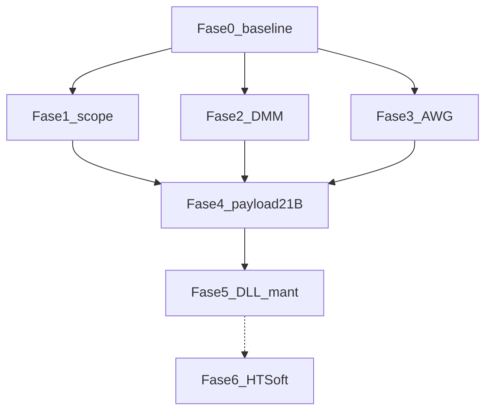

# Pendientes, pruebas y plan hacia paridad con el manual (Hantek 2D72/2D42 v1.3)

Este documento resume **qué falta**, **qué falta probar en tu banco** y un **plan por fases** para acercarse a tener **funcional por USB/CLI** todo lo que el manual describe como uso del instrumento, dentro de la política del repo (**sin sniff USB en PC**; RE firmware/DLL + CLI + diff de estado).

**Fuentes consolidadas:** [`hantek/MANUAL_FIRMWARE_GAPS.md`](../hantek/MANUAL_FIRMWARE_GAPS.md), [`dev_docs/pyhantek/MANUAL_2D72_CLI_COBERTURA.md`](pyhantek/MANUAL_2D72_CLI_COBERTURA.md), [`dev_docs/pyhantek/IMPLEMENTACION_CHECKLIST.md`](pyhantek/IMPLEMENTACION_CHECKLIST.md), [`dev_docs/pyhantek/HALLAZGOS_DMM_DDS_2026-03.md`](pyhantek/HALLAZGOS_DMM_DDS_2026-03.md).  
**Índice general:** [`INDICE.md`](INDICE.md).

---

## 1. Qué significa “cerrar por completo”

El manual mezcla:

| Nivel | Contenido | Viabilidad con `pyhantek` actual |
|--------|-----------|----------------------------------|
| **A — Protocolo HTHardDll + firmware** | Scope/DMM/AWG por bulk 64 B, opcodes documentados | Objetivo realista del repo; hoy ~**60%** del catálogo de filas manual↔CLI (ver cobertura). |
| **B — Solo pantalla / flash / teclas** | Default settings F1/F4, Hold DMM, brillo, idioma, REF en flash | Muchas **sin** trama en `HTHardDll`; quedan en panel o requieren mapear bytes en `0x15` por experimento. |
| **C — Software PC (Scope.exe)** | Cursores, FFT PC, archivos `.hantek`, mediciones como en PC | **`HTSoftDll` / `MeasDll`**: otro cuerpo de trabajo; no está en el alcance típico de `hantek_usb`. |

**Conclusión:** “100% manual” en sentido estricto **no es un solo milestone** en este repositorio. Lo que sí se puede planificar es:

1. **Cerrar A** lo máximo posible (osciloscopio + DMM + AWG vía `HTHardDll`).
2. **Documentar B** (qué es solo UI, qué byte cambia si acaso).
3. **Encapsular C** como fase opcional / proyecto hermano.

El plan siguiente asume **prioridad A**, luego **B donde haya retorno**, y **C** explícitamente al final.

---

## 2. Resumen: qué falta (por bloque)

### 2.1 Osciloscopio

| Ítem | Estado | Cierre aproximado |
|------|--------|-------------------|
| Autoset = botón Auto del manual | Parcial | Criterio documentado + comparación LCD + `read-settings` / `settings_autoset_diff` con señal conocida (DDS y externa). |
| Y-T / Roll / Scan (escritura USB) | Abierto | Nueva vía o confirmación firmware; `0x0D` no escribe `ram98_byte0` como se esperaba. |
| Invert CH1/CH2 por USB | Roto/riesgo | RE `FUN_08031a9e` / `0x18`; no usar `ch-invert` en producción hasta entender disparo. |
| V/div índices 10–11 | Duda UI | `scope_label_walk` en CH1 + actualizar JSON. |
| Pulse width trigger | Desconocido | Buscar en firmware/DLL si existe opcode; si no, documentar “solo UI”. |
| Force trigger | Desconocido | Snapshots antes/después en panel; si no hay bytes en `0x15`, seguir firmware. |
| Medidas automáticas / cursores / guardar 6 trazas / REF | No en CLI | Fase HTSoftDll o solo documentación “no disponible por USB documentado”. |

### 2.2 Multímetro (DMM)

| Ítem | Estado | Cierre aproximado |
|------|--------|-------------------|
| Matriz modo ↔ trama 14 B | Parcial | Tabla en checklist: cada `dmm-type` con fuente/lazo conocido + test vector. |
| Formato `[6]==0x03` general | Parcial | Cerrar fórmula en `dmm_decode.py` + tests. |
| Hold / auto-range | ? | Diff `dmm-read` al togglear si existe vía UI. |
| Hold físico | N/A USB | Documentar explícitamente. |

### 2.3 Generador (AWG/DDS)

| Ítem | Estado | Cierre aproximado |
|------|--------|-------------------|
| Eco IN tras comandos | Documentado como no fiable | Matriz “qué subcódigo sirve para lectura real” si aplica. |
| `dds-offset` vs salida real | Parcial | Medición DMM/scope en lazo; actualizar hallazgos. |
| Cabecera `dds-download` completa | Parcial | RE `ddsSDKDownload` + firmware; tests de tamaño ya existentes → alinear layout byte a byte. |
| Burst/fase DLL | Opcional | Confirmar si 2D42 ignora. |

### 2.4 Utilidad y DLL “peligrosas”

| Ítem | Estado |
|------|--------|
| Idioma, sonido, brillo, apagado auto | Sin comando; opcional: barrido UI + snapshot `0x15`. |
| `zero-cali`, `factory-pulse`, `fpga-update`, … | CLI existe; falta matriz **qué hace en 2D42** y riesgo. |

---

## 3. Qué te falta **probar** (matriz para vos en banco)

Usá esta lista como checklist personal. Marcá fecha y modelo (`2d42`/`2d72`) en [`IMPLEMENTACION_CHECKLIST.md`](pyhantek/IMPLEMENTACION_CHECKLIST.md) cuando cierres filas.

### 3.1 Osciloscopio

1. **Autoset:** misma señal (p. ej. AWG→CH1 fijo), pulsá **Auto** en panel y guardá `snapshot_scope_state.py` antes/después; repetí con `scope-autoset` y `external_ch1_smoke --scope-autoset`; compará diffs.
2. **Y-T / Roll / X-Y:** cambiá solo con panel; snapshots antes/después; intentá correlacionar con `ram98_byte0`.
3. **V/div 10–11:** `ch-volt 0 10` y `11` en CH1; anotá LCD + `read-settings`.
4. **Trigger PW:** si el menú lo ofrece, activá PW y snapshot; buscá si cambia algún byte no documentado.
5. **Force:** seguí [`dev_docs/tools/PROCEDIMIENTO_force_trigger.txt`](tools/PROCEDIMIENTO_force_trigger.txt) (Normal vs Single).
6. **Invert:** solo menú (no `ch-invert` hasta nuevo aviso); snapshot invert on/off.

### 3.2 DMM

7. Recorrer **todos** los modos del manual con **referencia conocida** (fuente, resistencia, cap, diodo, continuidad, AC red si podés hacerlo con seguridad).
8. Anotar tramas 14 B “raras” y añadir vectores en `tests/` o en checklist.

### 3.3 AWG

9. Lazo **DDS→CH1** y **DDS→DMM** para frecuencia, amplitud, duty, rampa/trapecio según manual.
10. **Offset:** medir DC en salida vs lo que pide el CLI y el LCD.
11. **Arb:** descarga corta/larga y verificación en scope.

### 3.4 Riesgo (solo si decidís aceptarlo)

12. `factory-pulse`, ramas de `zero-cali`, `fpga-update`: solo con backup mental de que pueden afectar calibración; documentar resultado mínimo (“no op”, “mensaje X”, etc.).

---

## 4. Plan detallado por fases (para cerrar cada cosa)

Cada fase tiene: **objetivo**, **pasos**, **criterio de salida**, **artefactos** (doc/código/test).

### Fase 0 — Baseline y trazabilidad

- **Objetivo:** no trabajar a ciegas.
- **Pasos:**
  1. Congelar versión firmware/ARM que reporta `doctor` en checklist.
  2. Tener clon con `hantek/decompilado_HTHardDll/` y (si aplica) acceso a Ghidra para firmware cuando exista en el entorno.
  3. Reglas udev OK; `doctor` + `external_ch1_smoke` como humo diario.
- **Salida:** una línea “baseline hardware” en checklist + PID usado.
- **Artefactos:** ya existentes; solo disciplina de anotación.

### Fase 1 — Osciloscopio “duro” (HTHardDll)

- **Objetivo:** máxima paridad **medible** en scope sin HTSoftDll.
- **Pasos:**
  1. **Autoset:** definir criterio “equivalente al Auto del manual” (p. ej. time/div y V/div dentro de banda esperada para señal X); automatizar comparación snapshot o `settings_autoset_diff` + captura.
  2. **Y-T escritura:** seguir `MANUAL_FIRMWARE_GAPS` + `FUN_08031a9e` / DLL; si no hay vía, documentar “solo panel” y cerrar ítem.
  3. **V/div 10–11:** completar `ch_volt_map_empirico.json` en CH1.
  4. **Pulse width:** búsqueda en decompilados por strings/opcodes; si nada, cerrar como UI-only.
  5. **Force:** completar tabla de bytes con snapshots; si 0 bytes, issue firmware-only documentado.
  6. **`0x18`:** documentar semántica completa o deprecar CLI hasta nuevo aviso.
- **Salida:** tabla en `PROTOCOLO_USB.md` o `MANUAL_FIRMWARE_GAPS` actualizada con “cerrado / imposible por USB / solo UI”.
- **Artefactos:** tests allí donde haya lógica nueva; vectores hex para `read-settings`.

### Fase 2 — DMM matriz completa

- **Objetivo:** `dmm-read --parse` confiable en **todos** los modos del manual.
- **Pasos:**
  1. Hoja de ruta modo 0…N con caso de prueba físico por fila.
  2. Ampliar `dmm_decode.py` + tests por cada patrón nuevo.
  3. Cerrar `[6]==0x03` con regla general o familia de reglas documentadas.
  4. Hold/auto-range: experimento panel + diff si aplica.
- **Salida:** §8 de `MANUAL_FIRMWARE_GAPS` tachado o referenciado a tests concretos.
- **Artefactos:** `test_parse_and_protocol.py` o archivo dedicado DMM.

### Fase 3 — AWG/DDS paridad práctica

- **Objetivo:** generador usable como en manual para formas estándar + arb.
- **Pasos:**
  1. Documento corto “fuente de verdad” para eco IN (qué ignorar).
  2. `dds-offset`: tabla medición vs CLI vs LCD.
  3. `dds-download`: layout final en `PROTOCOLO_USB` alineado a RE.
  4. Opcionales DLL burst/fase: una pasada sí/no en hardware.
- **Salida:** checklist §C sin ítems abiertos críticos.
- **Artefactos:** tests tamaño/muestras ya iniciados; ampliar según cabecera.

### Fase 4 — Payload `0x15` byte a byte (opcional pero potente)

- **Objetivo:** correlacionar **cada** byte del bloque de 21 B con algo visible en UI cuando sea posible.
- **Pasos:** cambiar un solo control en panel → snapshot → anotar; construir tabla en doc.
- **Salida:** nueva subsección en `PROTOCOLO_USB` o anexo.
- **Utilidad:** desbloquea utilidades “solo panel” parcialmente observables por USB.

### Fase 5 — Comandos DLL de mantenimiento

- **Objetivo:** matriz riesgo/beneficio en **tu** 2D42.
- **Pasos:** por comando (`zero-cali`, `factory-pulse`, …): leer decomp, ejecutar si aceptás riesgo, anotar efecto en checklist §D.
- **Salida:** tabla “seguro / peligroso / no probado”.

### Fase 6 — Paridad tipo “Scope.exe” (opcional, gran esfuerzo)

- **Objetivo:** mediciones automáticas, cursores, REF, archivos proyecto PC.
- **Pasos:** inventariar exports `HTSoftDll`/`MeasDll`, decidir si vale un subpaquete Python aparte.
- **Salida:** diseño o repo nuevo; **no** bloquea Fases 1–3.

---

## 5. Orden recomendado y dependencias

**Paralelizable:** F1, F2 y F3 comparten F0 pero poco entre sí; un solo operador en banco suele serializar por tiempo.

---

## 6. Cómo mantener este documento vivo

- Al cerrar un ítem: enlace a PR/commit, test y línea en `IMPLEMENTACION_CHECKLIST.md` “Resultados en vivo”.
- Si el manual del fabricante cambia de versión, repetir §7 del `MANUAL_FIRMWARE_GAPS` (índice manual → repo) y ajustar porcentajes en `MANUAL_2D72_CLI_COBERTURA.md`.

---

*Última actualización del plan maestro: 2026-03-25. Ajustar fechas y evidencias según tu avance.*
